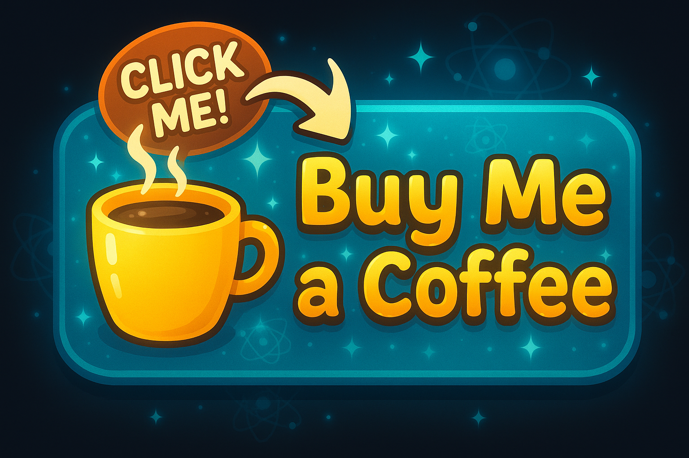

# Quantum Atom Explorer

Welcome to the **Quantum Atom Explorer**! This interactive science tool lets you explore the quantum world of atoms, electrons, and chemistry in a visually stunning and educational way.

## Features
- **Atom Explorer:** Visualize atomic structure and quantum numbers interactively.
- **Electron Explorer:** See electron probability clouds and quantum orbitals in 3D.
- **Chemistry Lab:** Mix elements, create molecules, and learn chemistry hands-on.
- **Modern UI:** Beautiful, animated interface with responsive design.
- **Guided Tour, Settings, and About:** Learn more about the science and the app.

## 🚀 Try It Out Instantly!

  
   
  <strong style="font-size:1.2em; color:#48cae4;">✨ No install needed — runs right in your browser! ✨</strong>

Or open any of the main pages locally:
- `index.html` — Atom Explorer
- `electron.html` — Electron Explorer
- `lab.html` — Chemistry Lab

---

## 🖼️ App Screenshots

  
  
  

---

## ❤️‍🔥 Help Keep This Project Free! ❤️‍🔥

  <strong style="font-size:2em;">⬇️⬇️⬇️</strong> 
  
   
  <strong style="font-size:1.3em;">✨ Click the coffee cup above to donate instantly! ✨</strong>
   
  <em>Your support keeps this project alive and free for everyone. Thank you! 💖</em>

---

---

## Credits
Created by Science Nerds. Powered by Quantum Canvas.

---

## License
MIT License. See LICENSE file for details.
